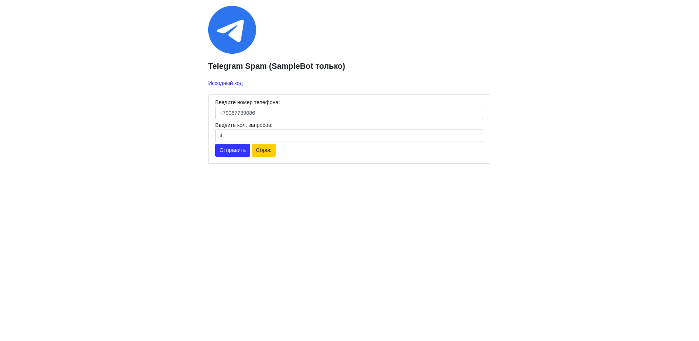

# TGpsam.py - документация

## Навигация
* [Как установить?](#как-использовать)
* [Как использовать?](#как-установить)
* [Отказ от ответственности](#отказ-от-ответственности)
* [Поддержать автора](#как-поддержать-автора)

## Как установить?
1. Нам нужна библиотека `pywebio` поэтому через PIP устанавливаем её `pip install pywebio`
2. После этого скачиваем проект `git clone https://github.com/tot-camiy-coder/TGspam.py.git`
3. Переходим в созданную папку `cd TGspam`
4. Запускаем `python tgspam.py`

## Как использовать?
Всё просто! 
Достаточно запустить файл, и перейти по [127.0.0.1:8080](https://127.0.0.1:8080) и заполнить форму.

После нажатия кнопки `Отправить`
Вы получите сообщения о удачной отправки сообщений

Прошу заметить, что не стоит злоупотреблять данной программой!

## Отказ от ответственности

Настоящим сообщаем, что автор программы **не несет ответственности** за любые убытки, ущерб или последствия, возникающие в результате использования данной программы. Пользователь принимает на себя все риски, связанные с использованием программы, включая, но не ограничиваясь:

- **Потерей данных**
- **Неправильным функционированием программы**
- **Ущербом для оборудования или программного обеспечения**
- **Нарушением прав третьих лиц**

Программа предоставляется **"как есть"**, и автор не гарантирует ее безошибочную работу или соответствие конкретным требованиям пользователя.

Используя программу, пользователь подтверждает свое согласие с вышеизложенными условиями и осознает все возможные риски.

  

## Как поддержать Автора?
Его можно поддержать, купив кофе через [DonateAlerts](https://www.donationalerts.com/r/tot_camyi_coder)  
Автор будет очень благодарен любому донату  

